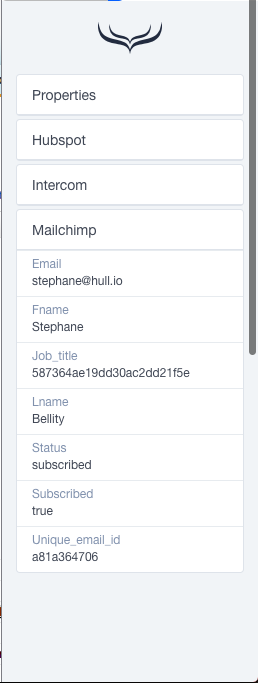
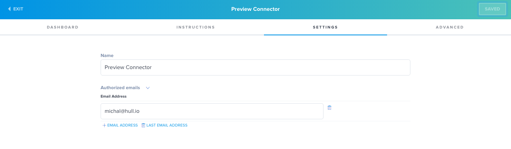
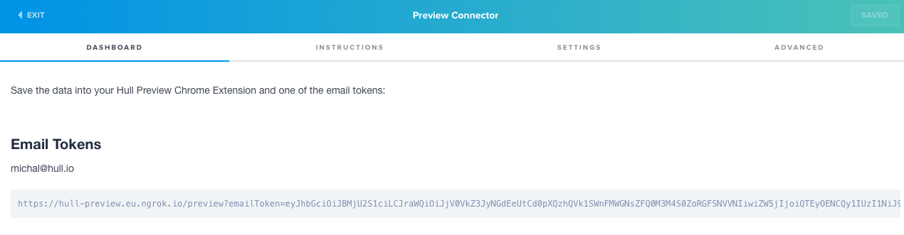
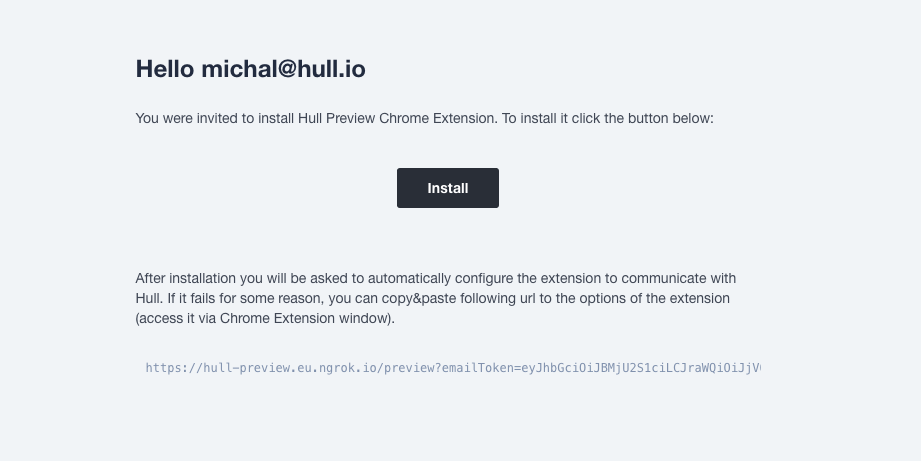
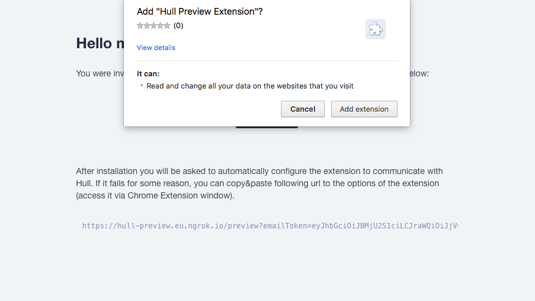
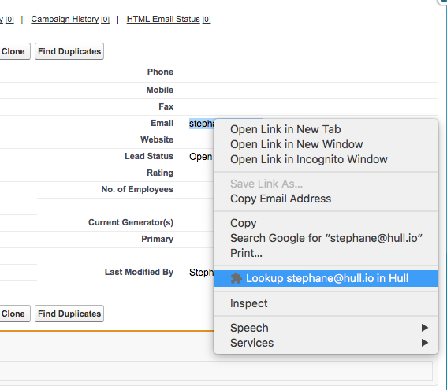

# Hull ♥ Chrome

This connector allows loading selected user data preview using a Chrome Extension and a browser sidebar.
The extension adds custom context menu which allows to do a quick lookup of the selected e-mail in the Hull userbase, on selected list of websites it also detect the emails automatically.

## Configuration

To grant new user access to the sidebar data add his email to the list in this connector settings.

Then in dashboard pane you will see a unique installation url for that new user:

Send the url to the user, when he opens it the extension will install automatically.

To revoke the access, remove selected email address from Connector settings.

## Installation

Access the url provided by the connector administrator:

Then click the `Install` button:

When the extension is installed and configured, on any website you can lookup a selected e-mail address:

You can toggle the sidebar with the Extension Icon.

