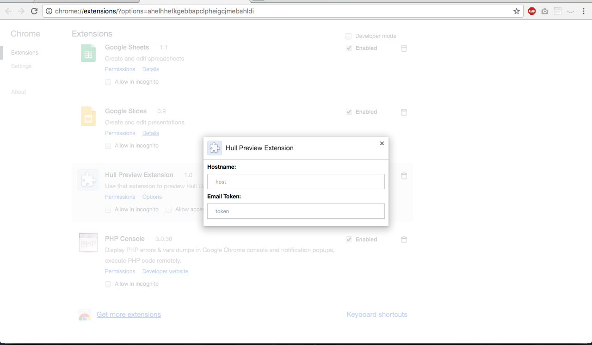

# Hull ♥ Chrome

This connector allows loading an user data preview using a Chrome Extension.
The extension adds custom context menu which allows to do a quick lookup of the selected e-mail in the Hull userbase.

## Installation

Download the extension from this link:

https://www.dropbox.com/s/g1bf9i6qjqg6szg/hull-preview-extension.crx?dl=1

Then drag the file into "Extension" window of Chrome browser:

Open option of the extension and paste in provided connector information:

When the extension is configured, on any website you can lookup a selected e-mail address:

You can toggle the sidebar with the Extension Icon.

## Authorization

The Email Token which is needed to authorize the extension is generated for a particular emails which list is set in Connectors settings.

To grant new user access to the sidebar data add his email to the list and provide him the token.

To revoke the access, remove selected email address from Connector settings.

